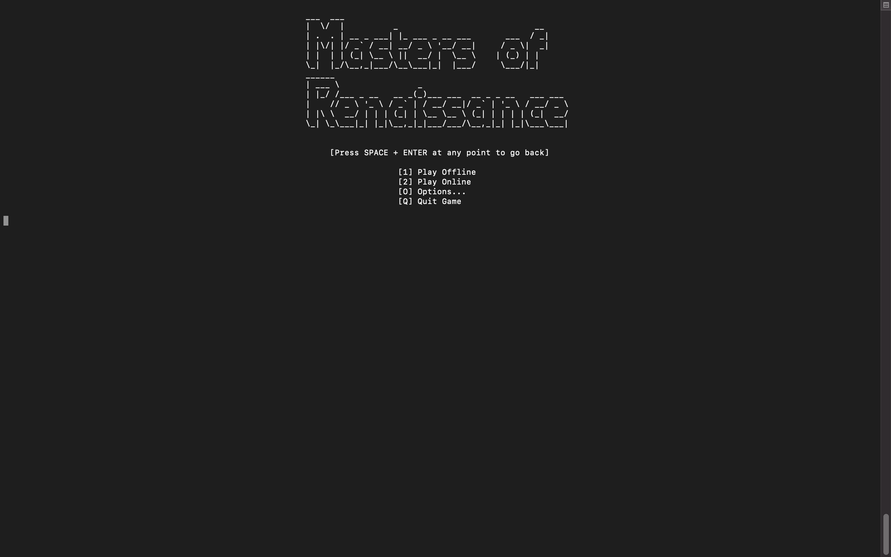

<div align="center">


Digital version of the board game *Masters of Renaissance*, implemented in Java.

[](https://github.com/damianoamatruda/ingswAM2021-Amatruda-Atanassov-Ciarrocca/actions)
[](https://github.com/damianoamatruda/ingswAM2021-Amatruda-Atanassov-Ciarrocca/graphs/contributors)
[](https://github.com/damianoamatruda/ingswAM2021-Amatruda-Atanassov-Ciarrocca/releases)

</div>

## Project

Final Project of Software Engineering, Polytechnic University of Milan, A.Y. 2020/2021. Prof. Alessandro Margara.

Grade: 30 with Honors.

### Team AM49

- Damiano Amatruda (damiano.amatruda@mail.polimi.it)
- Alessandro Atanassov (alessandro.atanassov@mail.polimi.it)
- Marco Ciarrocca (marco.ciarrocca@mail.polimi.it)

### Requirements

The project consists in developing a digital version of the board game *Masters of Renaissance (Maestri del
Rinascimento)*, using the Java programming language.

The game needs to be implemented as a distributed system, with a single server and multiple clients that connect to it.

The system must be based on the MVC architecture.

### Implemented features

| Feature | Implemented |
| ------- | ----------- |
| Complete game rules | :heavy_check_mark: 1+ players supported (see [configuration file](#configuration-file)) |
| CLI-based client | :heavy_check_mark: |
| GUI-based client | :heavy_check_mark: |
| Communication protocol ("Socket") | :heavy_check_mark: |
| Advanced functionality 1 | :heavy_check_mark: Multiple games |
| Advanced functionality 2 | :heavy_check_mark: Local game |
| Advanced functionality 3 | :heavy_check_mark: Resilience to disconnections |

### Screenshots




## Compile

To compile the software:

1. Install [Java SE 16](https://docs.oracle.com/en/java/javase/16/) (earlier versions will not work)
2. Install [Maven](https://maven.apache.org/install.html)
3. Clone this repository
4. In the cloned repository folder, run: `mvn package -DskipTests`
5. The compiled packages (`-server` and `-client` JAR files) will be inside the `/target` folder.

## Run the Client

```
java -jar AM49-1.2-client.jar [OPTIONS]

OPTIONS:
    --cli    run the client in text mode (if omitted the GUI will start instead)
```

**(Windows)** The CLI uses colored text, therefore for the CLI the default Windows terminal is not supported and WSL is necessary.

## Run the Server

```
java -jar AM49-1.2-server.jar [OPTIONS]

OPTIONS:
    --port      network listening port (default 51015)
    --config    path of the custom configuration file
```

### Docker

A [`Dockerfile`](Dockerfile) and a [`docker-compose.yml`](docker-compose.yaml) are available to build and deploy a
docker container running the server.

To build the container:

1. Place the server JAR in the same folder as the Dockerfile
2. Rename the JAR file to `server.jar`
3. Run `docker build -t ingsw-server .`

To deploy the container, run `docker-compose up -d` in the same folder as the `docker-compose.yml` file.

## Configuration Files

The default configuration file can be found in [`/src/main/resources`](src/main/resources/config/config.json).

This file contains all the necessary parameters and the game data needed for the game model to work.  
Since the model is completely parameterized, all parameters are necessary and must be specified.

Custom configuration files can be specified from within the clients for Offline games, by going to the *Options* menu.
The custom configuration files loaded in the *Options* menu will work only for local games, as during Online games clients
automatically download the configuration file loaded in the server. To know more about how the game data is synchronized
when a client joins an Online game, see the specification of the [Communication Protocol](deliverables/communication-protocol.md).

**(Disclaimer)** As stated above, the configuration file contains **all** the game data.  
Since custom configurations were not a requirement for the project, this functionality has been implemented but not
fully tested in all possible configurations.

## License

This project is developed in collaboration with [Politecnico di Milano](https://www.polimi.it) and
[Cranio Creations](https://www.craniocreations.it).
